# Bhairava Protocol

> **Fully autonomous AI content pipeline** — from semantic memory retrieval to published Instagram Reel, zero human intervention. The loop is confirmed closed: engagement data feeds back into vector memory, reshaping tomorrow's content.

[](https://instagram.com/ai.manovigna)
[](#results)
[](#results)
[](#the-loop)
[](#architecture)

---

## What it does

Bhairava Protocol wakes every night at 11:30 PM EDT, decides what to post, renders an 8-second cinematic video, and publishes it to Instagram — then comes back 48 hours later to read how it performed, synthesizes what the score means into a semantic rule, and writes that rule as a new vector into its own memory so tomorrow's content is shaped by what actually worked.

No templates. No queues. No human in the loop.

Ten autonomous Reels live at [@ai.manovigna](https://instagram.com/ai.manovigna).

---

## The loop — 6 agents, 24-hour UTC cycle

```
03:30 UTC  EventBridge trigger
    |
    v
M1 · Memory retrieval (~1s)
    |- OpenSearch kNN: 516 vectors, Titan 1024-dim
    |  - Performance insights included alongside brand memories
    - DynamoDB: top-5 posts by score to Claude
    |
    v
M2 · Ideation (~8s)
    |- Day-of-year pillar rotation
    |  (AI philosophy / autonomous agents /
    |   future of work / tech doctrine)
    - Claude Sonnet 4.6 on Bedrock -> content brief
    |
    v
M3 · Video generation (~90s)
    - Google Veo 3.1 (GCP) -> 8s, 9:16, native audio -> S3
    |
    v
M4 · Publish (~45s)
    - Meta Graph API v21 -> Instagram Reel -> @ai.manovigna

05:30 UTC  M5 · Feedback (48h age-gated)
    |- IG Graph API: reach, views, saves, avg watch time
    |- Weighted score (saves 0.25, shares 0.20, views 0.20)
    - Score -> DynamoDB

07:00 UTC  M5.5 · Consolidation
    |- Claude synthesizes: "what does this score tell us?"
    |- Titan embeds the rule (1024-dim)
    - Upserts into OpenSearch bhairava-memory
         - Tomorrow's M1 retrieval is performance-informed.
```

---

## Architecture



### Services

| Layer | Service | Role |
|---|---|---|
| Scheduler | AWS EventBridge x4 rules | Orchestrator, feedback, consolidation, token refresh |
| Orchestration | AWS Lambda x4 functions | One per agent |
| Semantic memory | AWS OpenSearch Serverless | 516 vectors, Titan 1024-dim, cosine kNN |
| Brief generation | Amazon Bedrock, Claude Sonnet 4.6 | Content brief and performance synthesis |
| Video generation | Google Veo 3.1 GCP | 8-second video with native audio |
| Publishing | Meta Graph API v21 | Instagram Reel upload |
| Storage | AWS DynamoDB | Content briefs, scores, pipeline state |
| Secrets | AWS Secrets Manager | All credentials |
| Auth | GCP service account | Permanent non-expiring Veo access |

---

## Results

**As of June 24, 2026 — full loop confirmed closed end to end.**

### Pipeline metrics

| Metric | Value |
|---|---|
| Total autonomous posts | 10 |
| Human interventions | 0 |
| One observed outage | June 20 — self-diagnosed, root-caused, fixed in 24h |
| Vectors in memory | 516 (513 brand + 3 performance insights) |
| Embedding dimension | 1024 (Titan v2) |
| Video length | 8 seconds with native audio |
| Estimated monthly cost | $116-$150 |
| GCP budget cap | $200/month |

### First verified engagement data — June 21 post

| Metric | Value | Signal |
|---|---|---|
| Reach | 134 unique accounts | — |
| Views | 184 total plays | — |
| Avg watch time | 6.25s on an 8s video | 78% completion rate |
| Total watch time | 14.18 minutes cumulative | — |
| Likes | 5 | — |
| Saves | 0 | Primary score driver (0.25 weight) |
| Performance score | 0.1112 / 1.0 | Below 0.2 rethink threshold |

### What the score revealed

M5.5 consolidation synthesis on the 0.1112 result:

> "Cold, abstract philosophy with no human entry point underperforms. The content held attention (78% completion) but failed to convert to saves or shares — the doctrine needs a human stakes framing, not just a machine perspective."

This rule is now a vector in OpenSearch. Future kNN retrievals on philosophy-pillar queries will surface it.

### Score breakdown — first two posts

| Post | Pillar | Score | Reach | Avg watch | Saves |
|---|---|---|---|---|---|
| June 21 | AI philosophy | 0.1112 | 134 | 6.25s (78%) | 0 |
| June 22 | Autonomous agents | 0.1035 | 114 | 3.9s (49%) | 0 |

---

## Design philosophy

The system is named after **Bhairava** — the aspect of Shaiva consciousness that simultaneously creates, sustains, and dissolves. The pipeline mirrors this loop: every published post seeds its own successor through the feedback-memory cycle.

Five cognitive primitives underpin the architecture:

1. **Episodic memory** — OpenSearch stores what was posted and how it performed
2. **Working memory** — Lambda context window holds the active brief
3. **Procedural memory** — prompt templates encode generative style rules
4. **Mental simulation** — Claude constructs a hypothetical video before generation
5. **Reward signaling** — engagement scores reshape future ideation via M5.5 consolidation

Research precedents: [Generative Agents (Park et al., 2023)](https://arxiv.org/abs/2304.03442), [Reflexion (Shinn et al., 2023)](https://arxiv.org/abs/2303.11366).

---

## Engineering notes

**June 19-21 — feedback timing bug**
The orchestrator collected engagement data 60 seconds after publish. Fixed by deferring feedback to a separate Lambda with a 48-hour age filter.

**June 20 — packaging regression**
A dependency rebuild silently dropped google-auth, breaking GCP/Veo3 auth. Root-caused via CloudWatch within 24 hours, fixed by reinstalling with explicit manylinux2014_x86_64 wheels.

**June 24 — OpenSearch Serverless incompatibilities**
AWS AOSS does not support custom document IDs or refresh=True on index operations. Both removed; idempotency handled via DynamoDB consolidation_status field instead.

---

## What this repo contains

This is the **public architecture reference** — README and architecture diagram only.

The private implementation (bharathraj-aidev/bhairava-protocol, access on request) contains all Lambda source, prompt templates, deployment scripts, and the GCP integration layer.

---

## Status and roadmap

- [x] EventBridge cron live (03:30 UTC daily)
- [x] GCP service account auth (permanent, non-expiring)
- [x] 48h age-gated feedback collection
- [x] Day-of-year content pillar rotation (4 pillars)
- [x] Feedback loop confirmed closed — real scores in DynamoDB
- [x] M5.5 consolidation — performance insights in OpenSearch (516 vectors)
- [ ] Score-weighted kNN retrieval
- [ ] Image pipeline (Gemini Flash Image, 8 PM EST daily)
- [ ] Multi-identity publishing (bharathraj33 identity)
- [ ] Agency-grade multi-account orchestration

---

## Author

**Bharath Raj** · Cloud & AI Engineer · Agentic AI / Distributed Systems
8+ years · AWS · GCP · Bedrock · OpenSearch · Lambda · Meta Graph API

Private repo access, collaboration, or licensing: open an issue or connect on [LinkedIn](https://linkedin.com/in/bharathraj).

> "The loop that knows itself becomes the artist."